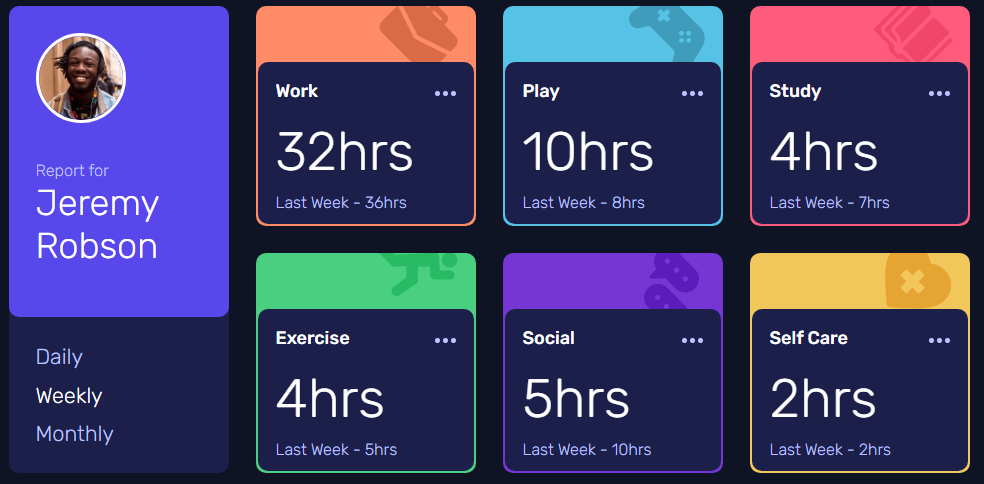

# Frontend Mentor - Time tracking dashboard solution

This is a solution to the [Time tracking dashboard challenge on Frontend Mentor](https://www.frontendmentor.io/challenges/time-tracking-dashboard-UIQ7167Jw). 

## Table of contents

- [Overview](#overview)
  - [The challenge](#the-challenge)
  - [Screenshot](#screenshot)
  - [Links](#links)
- [My process](#my-process)
  - [Built with](#built-with)
  - [What I learned](#what-i-learned)
  - [Useful resources](#useful-resources)
- [Author](#author)

## Overview

### The challenge

Users should be able to:

- View the optimal layout for the site depending on their device's screen size
- See hover states for all interactive elements on the page
- Switch between viewing Daily, Weekly, and Monthly stats

### Screenshot



### Links

- Solution URL: [https://github.com/NickAlldredge/frontend-mentor-time-tracking-dashboard](https://github.com/NickAlldredge/frontend-mentor-time-tracking-dashboard)
- Live Site URL: [https://nickalldredge.github.io/frontend-mentor-time-tracking-dashboard/](https://nickalldredge.github.io/frontend-mentor-time-tracking-dashboard/)

## My process

### Built with

- HTML5
- CSS custom properties
- Flexbox
- CSS Grid
- Mobile-first workflow


### What I learned

This was my first attempt at using CSS grids. See the [Useful resources](#useful-resources) section below for the different articles that helped me with grids.

My main takaway from this project is that web frameworks make things way easier. I used vanilla Javascript for this challenge, but was wishing the whole time I could be using React.

I also learned that `fetch()` can access the local file system (at least to my knowledge) so I had to load the JSON file manually as I was building the site locally.

```html
<input type="file" onchange="loadJsonLocal(this.files[0])">
```
When you upload the JSON file, this will call `loadJsonLocal` which is shown below:
```js
async function loadJsonLocal(file) {
    json = JSON.parse(await file.text());
    buildHtmlFromJson();
}
```
For the hosted version, I called this function instead:
```js
async function loadJson() {
    const jsonObject = await fetch("./data.json");
    json = await jsonObject.json();
    buildHtmlFromJson();
}
loadJson();
```

### Useful resources

- [Look Ma, No Media Queries!](https://css-tricks.com/look-ma-no-media-queries-responsive-layouts-using-css-grid/) - This was a really cool article about some clever ways to use CSS grids.
- [Things I've Learned About CSS Grid Layout](https://css-tricks.com/things-ive-learned-css-grid-layout/) - Another helpful article about how to use CSS grids.

## Author

- Website - [nickalldredge.com](https://www.nickalldredge.com)
- Frontend Mentor - [@NickAlldredge](https://www.frontendmentor.io/profile/NickAlldredge)
